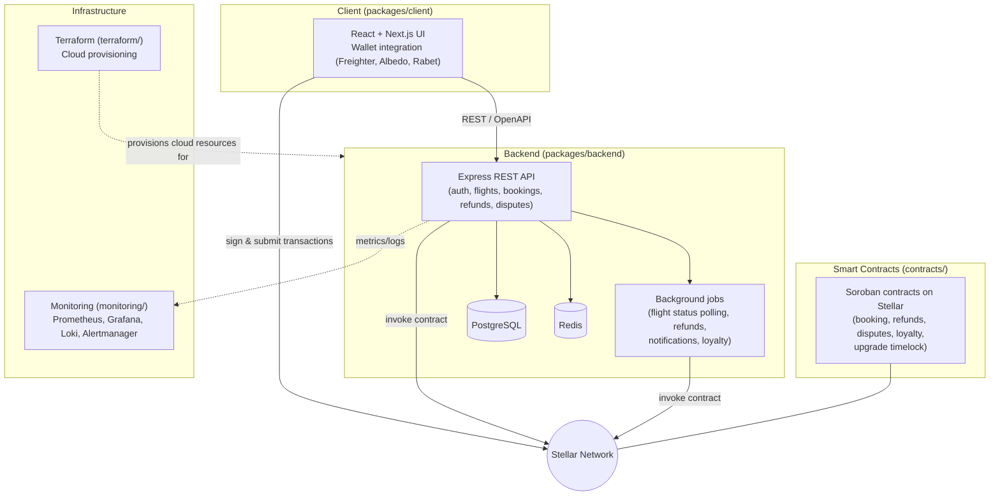

# Traqora – Decentralized Travel Booking on Stellar
//WIP
Traqora is a decentralized travel booking platform that allows users to book flights directly using blockchain technology on the Stellar ecosystem.

## What is Traqora?

Traqora eliminates intermediaries in the traditional travel booking system by leveraging the Stellar blockchain. This enables transparent, low-cost, and secure travel bookings with direct interaction between users and service providers.

Key benefits include:
- Transparent and immutable flight bookings
- Low transaction fees
- Direct user-to-airline interactions
- Automated refunds, cancellations, and dispute resolution via smart contracts

## Features

### Flight Booking
Users can search and book flights directly with airlines.

### Smart Contract Management
All bookings are handled through secure Soroban-based smart contracts on the Stellar network.

### Crypto Payments
Payments can be made using stablecoins or native tokens on the Stellar platform.

### Refund Automation
Cancellations and refund processes are automatically executed via smart contracts, ensuring fast and fair resolutions.

### Governance
An optional token-based governance system allows users to vote on proposed protocol upgrades.

### Loyalty Program
Frequent travelers are rewarded through a decentralized loyalty program built into the protocol.

## Technology Stack

Traqora is built using a robust and scalable tech stack designed for performance and security on the Stellar network.

Blockchain:  
- Stellar (Layer 1 blockchain)

Smart Contracts:  
- Soroban (native smart contract platform for Stellar)

Frontend:  
- Next.js
- Integrated with Stellar-compatible wallets like Freighter and Albedo

Off-chain Data Storage:  
- IPFS and Arweave are used for storing metadata securely and decentralizing file storage

Wallet Support:  
- Compatible with Freighter, Albedo, and Rabet wallets

Testing Tools:  
- Soroban CLI for smart contract development and testing
- Stellar SDK for integration testing

Monitoring & Analytics:  
- Stellar Expert for on-chain data tracking
- Dune Analytics for advanced analytics dashboards

## Architecture

Traqora is organized as a monorepo with four main areas: Soroban smart contracts, a Node/Express backend, a React client, and supporting infrastructure (monitoring and Terraform).



- **`contracts/`** — Soroban (Rust) smart contracts handling booking, refunds, disputes, loyalty and upgrade governance on Stellar.
- **`packages/backend/`** — Node/Express REST API plus background jobs; persists to PostgreSQL and Redis.
- **`packages/client/`** — React/Next.js frontend with wallet integrations.
- **`monitoring/`** — Prometheus, Grafana, Loki and Alertmanager configuration (see [docs/monitoring.md](./docs/monitoring.md)).
- **`terraform/`** — Infrastructure as code for cloud environments.

For deployment procedures see [docs/deployment-guide.md](./docs/deployment-guide.md) and the [Contract Deployment Runbook](./docs/operations/CONTRACT_DEPLOYMENT_RUNBOOK.md).

## Glossary

| Term | Definition |
|---|---|
| **Booking** | A reservation of a flight recorded off-chain in the backend and anchored on-chain via the booking Soroban contract. |
| **Refund** | The return of funds to a passenger after cancellation or service failure. Refunds can be automatic (policy-eligible) or manual (admin-reviewed). |
| **Dispute** | A formal disagreement raised by a passenger or operator over a booking or refund. Disputes are tracked off-chain and resolved via admin review or on-chain resolution. |
| **Soroban** | The native smart contracts platform of the Stellar network, used by Traqora for booking, refund, dispute and loyalty logic. |
| **Timelock** | The mandatory 48-hour delay between scheduling and executing a contract upgrade (see [Upgrade Procedure](./contracts/UPGRADE_PROCEDURE.md)). |
| **XLM** | The native asset of the Stellar network, used to pay transaction fees. |
| **Flight sync** | Background process that polls flight status/inventory providers and keeps local flight data up to date (see [Flight Sync Runbook](./docs/operations/FLIGHT_SYNC_RUNBOOK.md)). |

## Local Development with Docker

For a quick and easy setup of the entire development environment (including PostgreSQL, Redis, and a local Stellar node), we recommend using Docker Compose.

Refer to the [DOCKER_SETUP.md](./DOCKER_SETUP.md) for detailed instructions.

```bash
docker-compose up -d
```

## Installation & Setup

Before you begin, ensure the following tools are installed on your machine:
- [Stellar CLI](https://developers.stellar.org/docs/tools/developer-shells) (to interact with the Stellar network)
- Node.js (v18 or higher)
- Git (to clone and manage the repository)
- Docker & Docker Compose (optional, for local infrastructure dependencies)

### Step 1: Clone the Repository

Run the following commands in your terminal:

```bash
git clone https://github.com/your-username/traqora.git  
cd traqora
```

### Step 2: Configure Environment Variables

Copy the example environment variable files:
```bash
# Central env.example at repo root
cp env.example .env

# Backend env.example in packages/backend/
cp packages/backend/env.example packages/backend/.env
```
Open these files and configure the environment variables as needed. Refer to the comments in [env.example](./env.example) and [packages/backend/env.example](./packages/backend/env.example) for detailed information on types and default values.

For a single table of every variable with its type, default and description, see the [Environment Variable Reference](./docs/ENV_REFERENCE.md). It is generated from the `env.example` files. See [packages/backend/docs/ENV_DOCS.md](./packages/backend/docs/ENV_DOCS.md) for how to add a variable.

### Step 3: Install Dependencies

From the repository root, install dependencies for the entire monorepo:
```bash
npm install
```

> **Note:** Some packages in this project depend on React 19, which may cause peer dependency warnings with older tooling. If you see `ERESOLVE` errors during install, append the `--legacy-peer-deps` flag:
> ```bash
> npm install --legacy-peer-deps
> ```

### Step 4: Run the Application

To run both the backend and client packages in development mode:
```bash
npm run dev
```

Alternatively, you can run individual packages:
```bash
# Start backend dev server only
npm run dev --workspace=packages/backend

# Start client/frontend dev server only
npm run dev --workspace=packages/client
```

### Step 5: Connect Your Wallet

Use Freighter, Albedo, or Rabet wallet in your browser to connect and interact with the Traqora dApp.

## Testing

To run tests across all workspaces:
```bash
npm run test
```

For smart contract testing:
```bash
soroban test
```

## Production Deployment

Before deploying Traqora to a staging or production environment, review the [Production Deployment Checklist](./docs/DEPLOYMENT_CHECKLIST.md) to ensure all steps are correctly followed.

Key sections of the checklist include:
- **Pre-deployment checks** (verifying tests, building contracts, configuring secrets)
- **Soroban contract deployment** and retrieving contract IDs
- **Configuring backend and client environment variables**
- **Running database migrations**
- **Post-deployment smoke testing and health checks**
- **Rollback strategies**

## Contributing

We welcome contributions from the community. Please refer to our [Contributing Guide](./CONTRIBUTING.md) before submitting any pull requests.

## License

This project is licensed under the MIT License. See the LICENSE file for more information.

